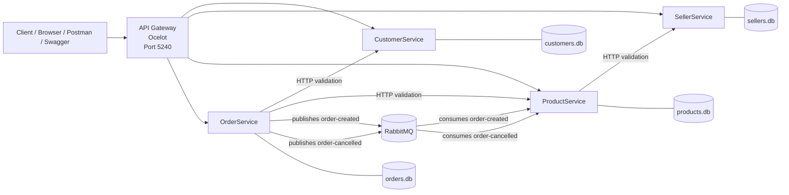

# Extension of Containerized E-Commerce Microservices Backend

Course: Programming for the Internet

## 1. Introduction

This project extends the midterm e-commerce microservices backend. The system contains four independent ASP.NET Core microservices:

- `CustomerService.Api`: manages customer records.
- `SellerService.Api`: manages seller records.
- `ProductService.Api`: manages products and stock.
- `OrderService.Api`: manages orders and order status.

The extension adds three main improvements to the midterm project:

- An API Gateway using Ocelot as the single entry point for client requests.
- Additional RabbitMQ messaging with an `OrderCancelled` event.
- DTO-based request and response models to avoid exposing EF Core entity models directly.

The project keeps the database-per-service architecture. Each business service owns its own SQLite database and EF Core `DbContext`.



## 2. API Gateway Design

The project adds `ApiGateway.Api` as the single client-facing entry point. It uses Ocelot and reads route configuration from `ocelot.json`.

Gateway base URL:

```text
http://localhost:5240
```

Route mapping:

| Gateway route | Downstream service |
|---|---|
| `/gateway/orders` | `http://orderservice:8080/api/orders` |
| `/gateway/orders/{everything}` | `http://orderservice:8080/api/orders/{everything}` |
| `/gateway/products` | `http://productservice:8080/api/products` |
| `/gateway/products/{everything}` | `http://productservice:8080/api/products/{everything}` |
| `/gateway/customers` | `http://customerservice:8080/api/customers` |
| `/gateway/customers/{everything}` | `http://customerservice:8080/api/customers/{everything}` |
| `/gateway/sellers` | `http://sellerservice:8080/api/sellers` |
| `/gateway/sellers/{everything}` | `http://sellerservice:8080/api/sellers/{everything}` |

In Docker Compose, the Gateway uses service names such as `orderservice`, `productservice`, `customerservice`, and `sellerservice` instead of `localhost`. This is required because containers communicate through the Docker network.

For demonstration purposes, the Gateway also includes Swagger-visible proxy controller endpoints for the main `/gateway/...` routes. This makes it possible to test the system from one Swagger UI instead of switching between Swagger and external tools for Ocelot forwarding routes.

Swagger UI:

```text
http://localhost:5240/swagger
```

Swagger-visible Gateway endpoints include:

- `GET/POST /gateway/customers`
- `GET /gateway/customers/{id}`
- `GET/POST /gateway/sellers`
- `GET /gateway/sellers/{id}`
- `GET/POST /gateway/products`
- `GET /gateway/products/{id}`
- `GET/POST /gateway/orders`
- `GET /gateway/orders/{id}`
- `POST /gateway/orders/{id}/cancel`
- `GET /gateway/order-details/{id}`

The Gateway also includes an aggregated endpoint:

```text
GET /gateway/order-details/{id}
```

Aggregation logic:

1. The Gateway calls `OrderService` using `GET /api/orders/{id}`.
2. It reads `CustomerId` and `ProductId` from the order response.
3. It calls `CustomerService` using `GET /api/customers/{customerId}`.
4. It calls `ProductService` using `GET /api/products/{productId}`.
5. It returns a combined response with order, customer, and product data.

Example response shape:

```json
{
  "order": {
    "id": 1,
    "customerId": 1,
    "productId": 1,
    "quantity": 4,
    "total": 160.00,
    "status": "Cancelled"
  },
  "customer": {
    "id": 1,
    "name": "Cancel Customer",
    "email": "cancel.customer@example.com"
  },
  "product": {
    "id": 1,
    "name": "Cancel Product",
    "price": 40.00,
    "stock": 20,
    "sellerId": 1
  }
}
```

## 3. Messaging Design

RabbitMQ is used to decouple order operations from product stock operations.

The system uses two events:

| Event | Queue | Producer | Consumer | Reaction |
|---|---|---|---|---|
| `OrderCreated` | `order-created` | `OrderService.Api` | `ProductService.Api` | Decrease product stock |
| `OrderCancelled` | `order-cancelled` | `OrderService.Api` | `ProductService.Api` | Restore product stock |

`OrderCreated` flow:

1. A client creates an order through `POST /gateway/orders`.
2. Gateway forwards the request to `OrderService`.
3. `OrderService` validates the customer and product through HTTP calls.
4. `OrderService` saves the order with `Status = "Created"`.
5. `OrderService` publishes an `order-created` message.
6. `ProductService` consumes the message and decreases the product stock.

`OrderCancelled` flow:

1. A client cancels an order through `POST /gateway/orders/{id}/cancel`.
2. Gateway forwards the request to `OrderService`.
3. `OrderService` changes the order status to `Cancelled`.
4. `OrderService` publishes an `order-cancelled` message.
5. `ProductService` consumes the message and restores the product stock.

Verified test result:

```json
{
  "OrderStatusBeforeCancel": "Created",
  "InitialStock": 20,
  "StockAfterOrder": 16,
  "CancelledStatus": "Cancelled",
  "StockAfterCancel": 20,
  "DetailsStatus": "Cancelled"
}
```

This confirms that creating an order reduced stock from `20` to `16`, and cancelling the order restored stock from `16` to `20`.

## 4. DTO Design

DTOs are used so services do not expose EF Core entity classes directly through their APIs.

The purpose of using DTOs is to:

- Separate API contracts from database entity models.
- Control which fields clients can send in requests.
- Control which fields services return in responses.
- Reduce coupling between services and internal domain models.

DTOs used in this project:

| Service | Request DTO | Response DTO |
|---|---|---|
| CustomerService | `CreateCustomerRequest` | `CustomerResponse` |
| SellerService | `CreateSellerRequest` | `SellerResponse` |
| ProductService | `CreateProductRequest` | `ProductResponse` |
| OrderService | `CreateOrderRequest` | `OrderResponse` |

Example DTOs from `OrderService`:

```csharp
public class CreateOrderRequest
{
    public int CustomerId { get; set; }
    public int ProductId { get; set; }
    public int Quantity { get; set; }
    public decimal Total { get; set; }
}

public class OrderResponse
{
    public int Id { get; set; }
    public int CustomerId { get; set; }
    public int ProductId { get; set; }
    public int Quantity { get; set; }
    public decimal Total { get; set; }
    public string Status { get; set; } = string.Empty;
}
```

Example mapping from request DTO to entity:

```csharp
var order = new Order
{
    CustomerId = request.CustomerId,
    ProductId = request.ProductId,
    Quantity = request.Quantity,
    Total = request.Total,
    Status = "Created"
};
```

Example mapping from entity to response DTO:

```csharp
return new OrderResponse
{
    Id = order.Id,
    CustomerId = order.CustomerId,
    ProductId = order.ProductId,
    Quantity = order.Quantity,
    Total = order.Total,
    Status = order.Status
};
```

## 5. Challenges and Solutions

Challenge 1: API Gateway routing in Docker.

The lecture example used `localhost` for downstream services. In Docker Compose, `localhost` inside the Gateway container refers to the Gateway container itself.

Solution: Ocelot routes use Docker service names such as `orderservice`, `productservice`, `customerservice`, and `sellerservice`.

Challenge 2: Swagger and Ocelot routing.

Ocelot routes in `ocelot.json` are not automatically displayed as Swagger endpoints.

Solution: In addition to Ocelot route configuration, proxy controller endpoints were added in `ApiGateway.Api` for the main `/gateway/...` routes. This keeps the Ocelot-based Gateway design while allowing all major demo requests to be executed directly from one Swagger UI.

Challenge 3: Event design.

The second event was changed from `StockUpdated` to `OrderCancelled` because cancellation gives a clearer business reaction.

Solution: `OrderService` updates order status to `Cancelled` and publishes `order-cancelled`. `ProductService` consumes the event and restores stock.

Challenge 4: Startup order with RabbitMQ.

Services may try to connect before RabbitMQ is ready.

Solution: RabbitMQ has a Docker healthcheck, and dependent services wait for the RabbitMQ container to become healthy.

## 6. Conclusion

The project extends the midterm e-commerce backend with an API Gateway, RabbitMQ event-driven communication, and DTO-based API models.

The final system provides a single Gateway entry point for all client requests, supports route mapping to all services, includes an aggregated order details endpoint, and uses RabbitMQ to decouple order creation and cancellation from product stock updates. It also keeps database-per-service persistence with EF Core and runs through Docker Compose using:

```bash
docker compose up --build
```
