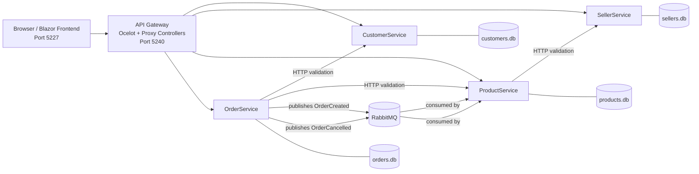

# Full-Stack Extension of Containerized E-Commerce Microservices System using Blazor

Course: Programming for the Internet

## 1. Introduction

This project extends the midterm containerized e-commerce microservices backend by adding a basic Blazor frontend.

The system keeps the existing distributed backend structure:

- `CustomerService.Api`: manages customer records
- `SellerService.Api`: manages seller records
- `ProductService.Api`: manages products and stock
- `OrderService.Api`: manages orders and order status
- `ApiGateway.Api`: provides a single client-facing entry point
- `RabbitMQ`: supports asynchronous messaging between services

The main goal of the final extension is to demonstrate end-to-end integration from a browser-based frontend to the backend microservices through the API Gateway.

## 2. Architecture Diagram

The final system uses a frontend + gateway + microservices structure. The frontend does not call business services directly. All browser requests go through the Gateway first.



## 3. System Overview

The backend continues to use the database-per-service approach. Each service owns its own SQLite database and EF Core `DbContext`.

The Gateway is the single entry point for frontend and external clients. Main Gateway routes include:

- `/gateway/customers`
- `/gateway/sellers`
- `/gateway/products`
- `/gateway/orders`
- `/gateway/order-details/{id}`

The system also keeps the event-driven backend flow from the previous extension:

- `OrderCreated` decreases product stock
- `OrderCancelled` restores product stock

All services, RabbitMQ, the Gateway, and the Blazor frontend are now included in Docker Compose and can be started with:

```bash
docker compose up --build
```

## 4. Frontend Overview

The frontend is implemented as a separate `Blazor WebAssembly` project named `Frontend`.

Frontend base URL:

```text
http://localhost:5227
```

Gateway base URL used by the frontend:

```text
http://localhost:5240
```

The frontend uses `HttpClient` for all API calls. It communicates only with the Gateway and never directly with `CustomerService`, `SellerService`, `ProductService`, or `OrderService`.

Example frontend API usage:

```csharp
builder.Services.AddScoped(sp => new HttpClient
{
    BaseAddress = new Uri("http://localhost:5240")
});
```

Implemented frontend pages:

- `Home`: simple navigation to main workflows
- `Products`: view all products and add a product
- `Customers`: view all customers and add a customer
- `Orders`: view all orders and create an order
- `Sellers`: view all sellers and add a seller

Core required features completed:

| Feature area | Implemented |
|---|---|
| Products | View all products, add a product |
| Customers | View all customers, add a customer |
| Orders | View all orders, create an order |

The `Sellers` page is included as support for the existing fourth service and helps product creation because each product requires a valid seller.

## 5. API Gateway Integration

The frontend calls the Gateway routes below:

| Frontend action | Gateway endpoint |
|---|---|
| View customers | `GET /gateway/customers` |
| Add customer | `POST /gateway/customers` |
| View sellers | `GET /gateway/sellers` |
| Add seller | `POST /gateway/sellers` |
| View products | `GET /gateway/products` |
| Add product | `POST /gateway/products` |
| View orders | `GET /gateway/orders` |
| Create order | `POST /gateway/orders` |

This satisfies the architectural requirement that the frontend must use the API Gateway only.

The Gateway then forwards requests to the downstream services using Docker service names such as:

- `customerservice`
- `sellerservice`
- `productservice`
- `orderservice`

This is necessary because containers communicate through the Docker network instead of using `localhost`.

## 6. Example Workflow

Example: creating an order from the UI.

1. Open the Blazor frontend in the browser.
2. Create or confirm an existing seller from the `Sellers` page.
3. Create or confirm an existing product from the `Products` page.
4. Create or confirm an existing customer from the `Customers` page.
5. Open the `Orders` page.
6. Select a customer, select a product, enter quantity, and submit the order form.
7. The frontend sends `POST /gateway/orders` through `HttpClient`.
8. The Gateway forwards the request to `OrderService`.
9. `OrderService` validates the customer and product through HTTP calls.
10. `OrderService` saves the order and publishes an `OrderCreated` event.
11. `ProductService` consumes the event and updates stock.
12. Refreshing the `Orders` or `Products` page shows the final end-to-end result.

## 7. Challenges and Solutions

Challenge 1: keeping the frontend aligned with the microservices architecture.

Solution: the frontend uses `HttpClient` with the Gateway base URL only. All browser requests are routed through `/gateway/...`.

Challenge 2: routing a Blazor SPA inside Docker.

Solution: the frontend is containerized with `nginx`, and `nginx.conf` uses a fallback route to `index.html` so direct navigation to routes such as `/products` and `/orders` still works.

## 8. Conclusion

The final project extends the midterm backend into a basic full-stack microservices system by adding a Blazor frontend.

The completed system now includes:

- four backend business services
- an API Gateway as the single entry point
- RabbitMQ for asynchronous order-related messaging
- a Blazor frontend for user interaction
- Docker Compose support for running the full stack together

The final result satisfies the main objectives of the extension: a simple but functional frontend, Gateway-based integration, end-to-end workflows for products, customers, and orders, and a containerized deployment that can be demonstrated with:

```bash
docker compose up --build
```
